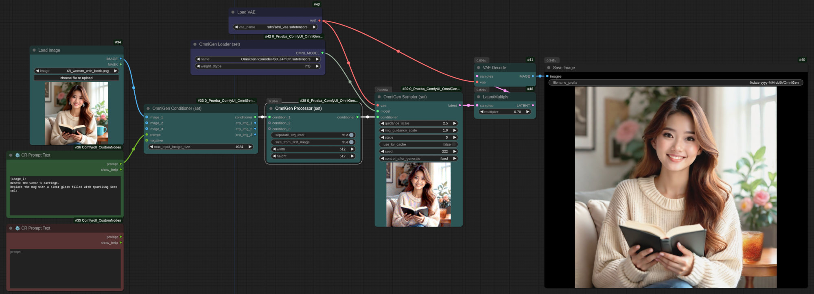

# ComfyUI_OmniGen_Wrapper



This node is an unofficial wrapper of the [OmniGen](https://github.com/VectorSpaceLab/OmniGen), running in ComfyUI.
The quantization code is from [Manni1000/OmniGen](https://github.com/Manni1000/OmniGen).
And the base node idea was from [chflame163/ComfyUI_OmniGen_Wrapper](https://github.com/chflame163/ComfyUI_OmniGen_Wrapper).


## Introduction

- OmniGen is an interesting model because it can do various tasks at once.
- It isn't fast
- It isn't high quality. You might want to refine the output using a better model like Flux.
- It consumes plenty of VRAM, in my tests 6 GB were enough to play with the model, but as you add more images and
  increase their size the memory consumption scales.
- This an LLM (SLM in according to Microsoft) based on [Phi-3](https://azure.microsoft.com/en-us/blog/introducing-phi-3-redefining-whats-possible-with-slms/)
  I can handle images mixed with the LLM tokes.

### Requirements

You'll need at least 8 GB of VRAM and during the model loading around of 24 GB of RAM.
If you have 16 GB of main RAM you'll need swap and plenty of patient.

### Feature of this node

- Negative prompt
- Upto 3 conditions
- Int8 quantization (8 GB of VRAM is enough, not 16 GB)
- 30% faster model load
- FP8 safetensors model (3.88 GB download not 15.5 GB)
- Can use installed SDXL VAE
- Image preview and progress bar indication

## Installation

### Install the nodes

Open a terminal window in the ```ComfyUI/custom_nodes``` folder and enter the following command:

```
git clone https://github.com/set-soft/ComfyUI_OmniGen_Nodes.git
```

### Install dependencies

Run the following command in the Python environment of ComfyUI:

```
python -s -m pip install -r ComfyUI/custom_nodes/ComfyUI_OmniGen_Nodes/requirements.txt
```

### Download models

I recommend downloading the models by hand, is much faster:

- You need the OmniGen-v1 model.
  - I recommend downloading the FP8 version of the model from
  [silveroxides/OmniGen-V1](https://huggingface.co/silveroxides/OmniGen-V1/tree/main). This is a 3.88 GB file.
  Just download the [model-fp8_e4m3fn.safetensors](https://huggingface.co/silveroxides/OmniGen-V1/resolve/main/model-fp8_e4m3fn.safetensors)
  file.
  - Create a folder named ```ComfyUI/models/OmniGen/``` and move the file there.
  - If you want to use the original model just download it from
    [Shitao/OmniGen-v1](https://huggingface.co/Shitao/OmniGen-v1/tree/main). This version is 15.5 GB and I couldn't find a
    difference in the results. Just download the
    [model.safetensors](https://huggingface.co/Shitao/OmniGen-v1/resolve/main/model.safetensors) file.
    You can move it to the same folder I recommend for the FP8 version.

- You need the SDXL VAE.
  - If you are already using SDXL this should be in ```ComfyUI/models/vae```
  - If you don't have it download the [diffusion_pytorch_model.safetensors](https://huggingface.co/stabilityai/sdxl-vae/resolve/main/diffusion_pytorch_model.safetensors) file
    from [stabilityai/sdxl-vae](https://huggingface.co/stabilityai/sdxl-vae/tree/main).
  - Move the file to ```ComfyUI/models/vae```, I suggest renaming it to something like ```sdxl_vae.safetensors```


You don't need the JSON files.

## How to use

The examples use the prompt node from [Comfyroll](https://github.com/Suzie1/ComfyUI_Comfyroll_CustomNodes/).
If you have the nodes manager extension just install the missing nodes from the manager.
Otherwise manually install the Comfyroll nodes.

Important note: the original work uses

### Very simple demo

1. Drag and drop the following image in ComfyUI:


2. Adjust the path for the model in **Omnigen Loader (set)** node
3. Adjust the path for the VAE in **Load VAE** node

Now you can play with this very simple workflow.

The above image was generated using [this image](https://github.com/VectorSpaceLab/OmniGen/blob/main/imgs/demo_cases/t2i_woman_with_book.png)
as input.

Here the prompt asks to remove the earrings and change the cup of coffee by a glass of coke.

### Compact demo

If you like compact nodes just use the following: [simplified.json](https://github.com/set-soft/ComfyUI_OmniGen_Nodes/blob/dev/examples/simplified.json)

### Nodes

- For the VAE just use the stock ComfyUI core VAE loader.
- For prompts use any node that allows entering text as a string.
  Note that you can also convert the prompt inputs to widgets by selecting the node and pressing right mouse button,
  then select "Convert input to widget".

#### OmniGen Loader (set)

This node is used to load the OmniGen model. It takes quite time to load. On my system around 25 seconds.
I reduced it from 36 seconds to 25 avoiding the initialization of some stuff. But more work is needed.

- **name** select the model name. Note that this node will scan ```ComfyUI/OmniGen``` but also ```ComfyUI/LLM```.
- **weight_dtype** use *int8* unless you have plenty of VRAM (24 GB or more) and you want the best quality possible.

#### OmniGen Conditioner (set)

This node is used to:

1. Ensure the images are in continuous. If you have 2 images they must be connected to *image_1* and *image_2*.
2. Resize the images to make them fit in the specified size.
3. Ensure the image sizes are multiple of 16
4. Replace the ```{image_1}```, ```{image_2}``` and ```{image_3}``` tags to the tags used by the model (<|image_N|></img>).

All images are optional, but using this model with just a text prompt isn't interesting.

Inputs:

- **image_1**: The image referred as ```{image_1}``` or just ```image_1``` in the prompt
- **image_2**: The image referred as ```{image_2}``` or just ```image_2``` in the prompt
- **image_3**: The image referred as ```{image_3}``` or just ```image_3``` in the prompt
- **prompt**: Instructions about what to do, note that internally the model receives *Generate an image according to the following
  instructions* and then the text you enter here.
- **negative**: An optional negative prompt. If you don't provide one the code uses an internal one (low quality, jpeg artifacts,
  ugly, duplicate, morbid, mutilated, extra fingers, mutated hands, "poorly drawn hands, poorly drawn face, mutation, deformed,
  blurry, dehydrated, bad anatomy, bad proportions, extra limbs, cloned face, disfigured, gross proportions, malformed limbs,
  missing arms, missing legs, extra arms, extra legs, fused fingers, too many fingers).

Outputs:

- **conditioner**: The information to condition the image generation validated and compacted in one connection.
- **crp_img_1**: The **image_1** input after adjusting its size. You can connect a "Preview Image" node here to see what exactly
  is receiving the model.
- **crp_img_2**: Same as **crp_img_1** but for **image_2**
- **crp_img_3**: Same as **crp_img_1** but for **image_3**

Parameters:

- **max_input_image_size**: The maximum size allowed in any of the directions. The 1024 value is a good one.
  Using bigger values you risk to use a very big image as input and end using tons of VRAM, and waiting forever.
  Using things like 512 might work, but this model needs "space" to work, some tasks aren't acomplished using 512x512 images.

#### OmniGen Processor (set)

This node takes the output of one or more ```OmniGen Conditioner (set)``` nodes and creates the tensors used to condition the model.
The process includes converting the prompts into tokens and providing space for the image latents.
Conditions are padded and attention masks created.

The sampler will generate one image for each condition, but the generated images are all affected by the conditions.
Isn't just a batch.

Inputs:

- **condition_1**: The output of an ```OmniGen Conditioner (set)``` to condition the first image generated
- **condition_2**: The output of an ```OmniGen Conditioner (set)``` to condition the second image generated
- **condition_3**: The output of an ```OmniGen Conditioner (set)``` to condition the third image generated

Outputs:

- **conditioners**: The tensors used to condition the image generation

Parameters:
- **separate_cfg_infer**: When enabled the conditions are applied one by one. This saves memory.
  When disabled the coditions are sent as batches. Note that sometimes this option not only saves time, but is also faster.
- **size_from_first_image**: Uses the size of the first image (from all the conditions) as the size of the output image.
- **width**: Width of the output image when **size_from_first_image** is disabled.
- **height**: Height of the output image when **size_from_first_image** is disabled.

As mentioned before: the model works better with 1024x1024 images, the 512x512 values used as defaults are to make it faster.


#### OmniGen Sampler (set)

This is the node that generates the image.

Inputs:

- **vae**: The Variable AutoEncoder (VAE) used to encode the input images into latent space. This must be the SDXL VAE.
  Connect a "Load VAE" node here.
- **model**: The OnmiGen-v1 model from the "OmniGen Loader (set)" node.
- **conditioner**: The generation conditions from the "OmniGen Processor (set)" node.

Outputs:

- **latent**: The image, or images, generated in latent format. Use a "VAE Decode" node to get an image.
  When using small number of steps you might want to connect a "LatentMultiply" node first, then adjust the the value to
  adjust the image luminosity. Start at 1. Useful if you get burned images.

Parameters:

- **guidance_scale**: How strong is the text prompt. The value must be between 1 and 5.
  Is the guidance scale as defined in [Classifier-Free Diffusion Guidance](https://arxiv.org/abs/2207.12598).
  **guidance_scale** is defined as **w** of equation 2 of [Imagen Paper](https://arxiv.org/pdf/2205.11487.pdf).
  Higher values makes the model to follow better the prompt, but cutting its freedom the quality gets lower.
- **img_guidance_scale**: How strong is the image guidance. The value must be between 1 and 2.
  Defined as equation 3 in [Instrucpix2pix](https://arxiv.org/pdf/2211.09800).
- **steps**: How many steps. More steps gives better quality, but takes more time. Using 5 is enough in same cases.
  In other cases you'll need as much as 50.
- **use_kv_cache**: Enable K/V (key/value) cache to speed up the inference. I don't recommend it because in the cases I tried the
  inference is faster but you'll need much more steps.
- **seed**: The random seed used to generate the initial noise latents.


## Statement

This project follows the MIT license, Some of its functional code comes from other open-source projects.
Thanks to the original author. If used for commercial purposes, please refer to the original project license to authorization
agreement.
